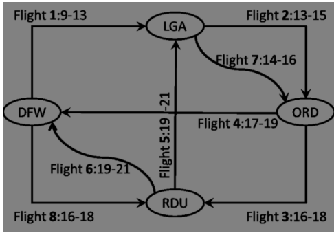
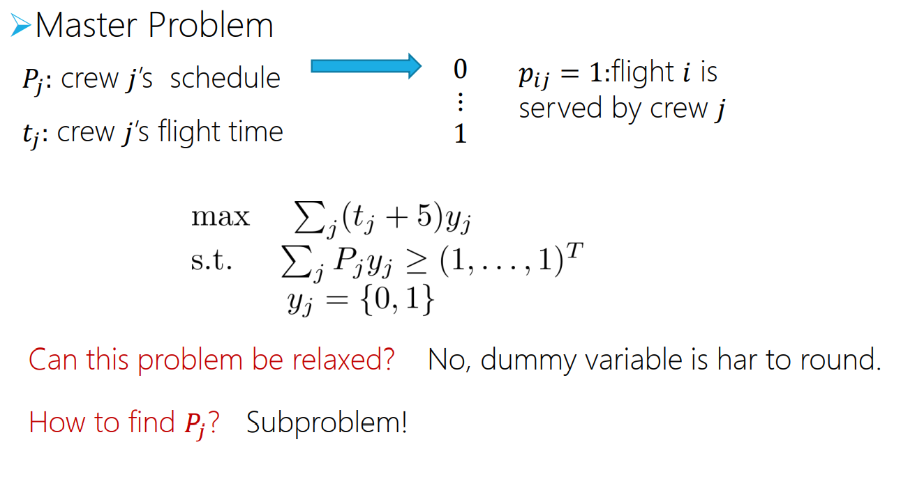
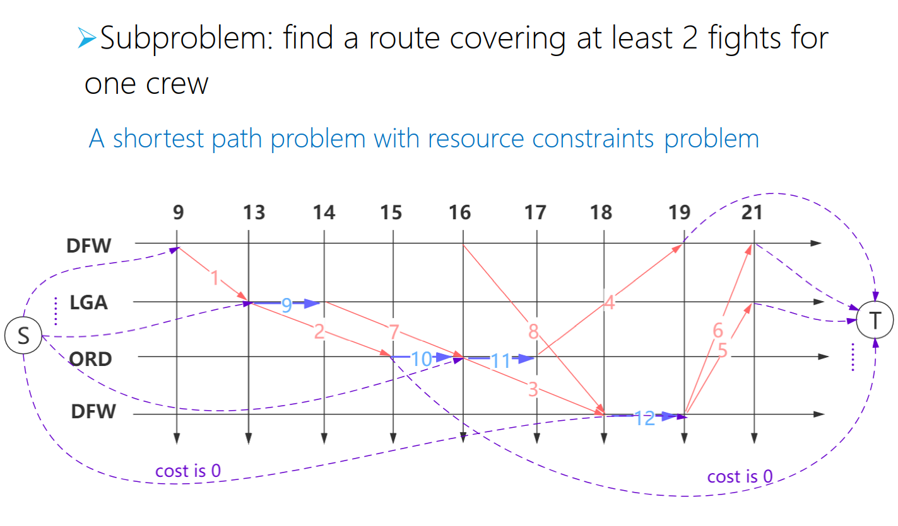
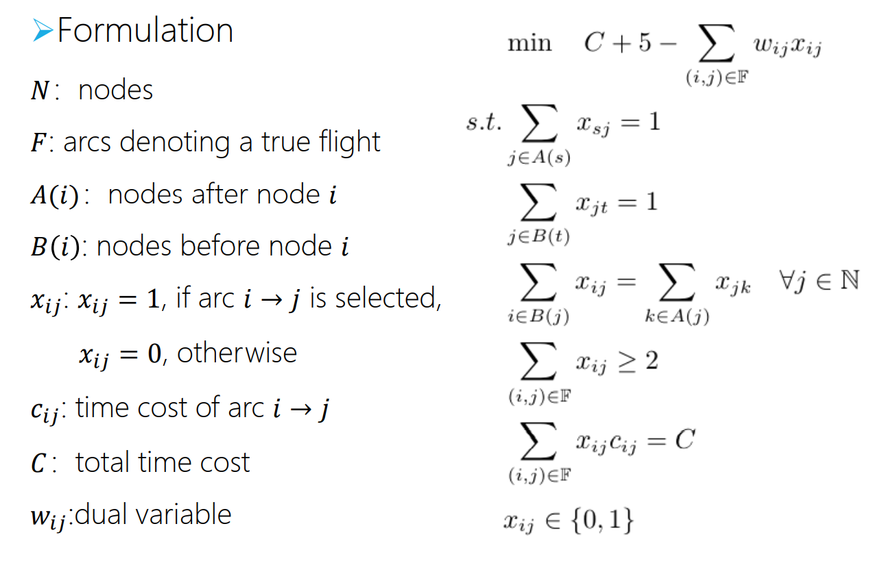

# Crew Scheduling Problem with Column generation

Course project of SJTU BUSS3528.

## Problem Definition

Consider the aircrew scheduling problem discussed in class. There are 8 flights serving 4 places. The following graph shows the flight schedule. Each node represents an airport, and each edge represents a flight and is labeled with the departure and arrival times. A series of flights could be serviced by a crew. In one series of flights, the departure time of a flight must be no earlier than the arrival time of the previous flight. For example, a series of flights 3 − 5 − 2 is impossible because flight 2′ departure time is earlier than the last flight 5′ arrival time.

Our task is to assign aircrews to different series of flights to cover the 8 flights and 4 places. We assume that each crew must serve at least two flights for efficiency. That is to say, any series of flights should contain no less than two flights. We can assign multiple crews to one flight if necessary to transport a crew to another airport. The pairing cost is expressed as the time interval between the first departure and last arrival, adding 5 hours. For example, the time cost of a series of flights 7 − 3 − 5 is 21 − 14 + 5 = 12 hours. Our objective is to minimize the total time cost. Please model and solve this problem.

## Master problem
Note that you dual variables are not available in an integer programming problem.
You need to solve the dual problem to calculate reduced costs.

## Subproblem
It's a shortest path problem that aims at finding a 
feasible pairing with the least reduced cost. It is defined 
over an acyclic time-space network.

